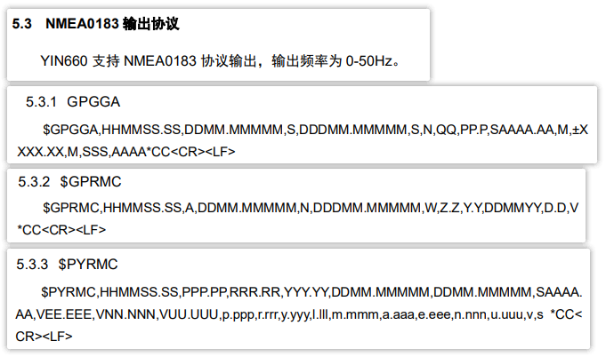
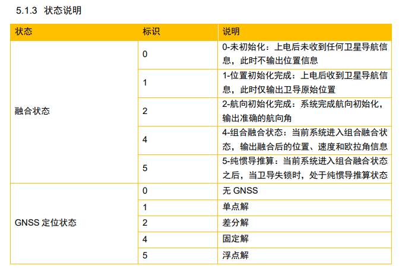

# new version for not using ROS
1. clone
     git clone  git@github.com:Yudong-Zhao/yesense_without_ros.git

2. build the project
     cd yesense_without_ros

    mkdir build

    cd build

    cmake ..

    make -j

3. test the output 

  ./yesense_imu_node


# 用法 : original version for ROS dependency

## 编译项目

1. git clone 此项目

2. 在**项目根目录下**打开终端，执行 `chmod +x *.sh` 为项目下的脚本增加可执行权限

3. 在**项目根目录下**打开终端，执行 `./build.sh` 编译整个项目

> 本项目包含一个 rosserial 库，在编译时会自动安装到当前工作区中

## 运行项目

> 要修改串口或者波特率，请在 `src/yesense/launch` 目录下的 *.launch 文件中进行更改, 无需重新编译

### 直接运行

- 在项目根目录下打开终端，输入 `./run.sh` 并执行

- 在项目根目录下打开终端，执行 `rostopic echo /imu/data` 可查看器件输出的原始数据

### 使用 rviz 进行可视化

- 在项目根目录下打开终端，输入 `./run_with_rviz.sh` 并执行

### 使用 ros self-defined topic
- 在项目根目录下打开终端，输入 `source devel/setup.bash ` 并执行
- 使用rostopic list查看当前包支持的topic
- 再使用自定义的topic

## 支持的 ros topic

### topic 中的数据单位
| Tid   : none                   |
| 温度   : ℃                     |
| 加计   : m/s2                   |
| 陀螺   : rad/s                  |
| 欧拉角 : deg                    |
| 四元数 : none                   |
| 时间戳 : us                     |
| 位置 : 经度/纬度 - deg, 高度 - m  |
| UTC :  年月日时分秒毫秒           |
| 组合状态 : none                  |

### ros 内置 topic

| topic | 含义 |
| :----  | :----  |
| /imu/data | imu 加计/陀螺数据 |
| /imu/marker | imu 姿态，定位，形状数据（用于 rviz 可视化） |

### yesense 扩展 topic

| topic | 含义 | 细节 |
| :----  | :----  | :---- |
| /yesense/command_resp | 获取 yesense 命令返回值 | 当使用 `rostopic pub` 设置传感器相应功能的时候，订阅该 topic 即可获取操作的返回值 |
| /yesense/sensor_data | 传感器数据 | 包含：温度，加计，陀螺，欧拉角，四元数，位置，时间戳 |
| /yesense/inertial_data | 惯性部分数据 | 包含：Tid, 温度，加计，陀螺，欧拉角，四元数, 时间戳 |
| /yesense/nav_data | 导航部分数据 | 包含：Tid, 数据位置，UTC, 组合状态 |
| /yesense/gnss_data | gnss 原始数据 |  |
| /yesense/gps_data | NMEA0183 输出的 gps 原始报文 |  |
| /yesense/imu_status | 传感器状态（融合状态，GNSS定位状态） |  |

### yesense 功能设置 topic

本处的 topic 用于设置传感器的相关功能，并获取功能的返回值状态；

打开终端，执行 `rostopic echo /yesense/command_resp` 命令开始监听 `功能设置 topic` 的返回值，当用户使用 `rostopic pub` 设置相应功能的时候，操作的返回值及状态将在此 topic 中输出

示例输出如下：

```
---
id: "yesense/gyro_bias_estimate"
cmd: "onn"
success: False
msg: "Invalid command: 'onn'"
data: []
```

返回值字段含义：

| 名称 | 类型 | 含义 |
| :---- | :---- | :---- |
| id | string | topic 名称 |
| cmd | string | topic 命令名称 |
| success | bool | 命令是否执行成功 |
| msg | string | 状态消息，当发生错误时，为相应的错误消息 |
| data | uint8\[] | 命令返回的字节数据 |

**1. 陀螺零偏自动估计功能**

topic 名称：`/yesense/gyro_bias_estimate`

  - 使能零偏估计：`rostopic pub /yesense/gyro_bias_estimate std_msgs/String "enable"`

    返回值示例：

    ```
    ---
    id: "yesense/gyro_bias_estimate"
    cmd: "enable"
    success: True
    msg: "ok"
    data: [0]
    ```

  - 关闭零偏估计：`rostopic pub /yesense/gyro_bias_estimate std_msgs/String "disable"`

    返回值示例：

    ```
    ---
    id: "yesense/gyro_bias_estimate"
    cmd: "disable"
    success: True
    msg: "ok"
    data: [0]
    ```

  - 查询功能状态：`rostopic pub /yesense/gyro_bias_estimate std_msgs/String "query"`

    返回值示例：

    ```
    ---
    id: "yesense/gyro_bias_estimate"
    cmd: "query"
    success: True
    msg: "ok"
    data: [81, 2]
    ```

